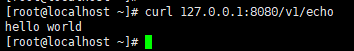

# CRPC 
是一个了解rpc如何实现的简单项目。

## 如何使用rpc服务？

如果只想使用rpc服务直接参考如下代码。
### step1
```
定义一个自己的proto
package echo;

option cc_generic_services = true;

message EchoRequest {
    required string msg = 1;
}

message EchoResponse {
    required string msg = 2;
}

service EchoService {
    rpc Echo(EchoRequest) returns (EchoResponse);
}
```
### step2
```
继承实现自己的服务
class MyEchoService : public echo::EchoService {
public:
  virtual void Echo(::google::protobuf::RpcController* /* controller */,
                       const ::echo::EchoRequest* request,
                       ::echo::EchoResponse* response,
                       ::google::protobuf::Closure* done) {
      response->set_msg(
              std::string("I have received '") + request->msg() + std::string("'"));
      done->Run();
  }
};//MyEchoService
```
### step3
```
设置ip端口直接开始
    ServerOption option(8080, "0.0.0.0");
    CRpcServer server;

    MyEchoService echo_service;
    server.add_service(&echo_service);
    server.start(option);


```


## 如何使用http服务？
### step1
```
定义http服务
package echo;

option cc_generic_services = true;

message HttpRequest {};
message HttpResponse {};

service HttpService {
  rpc Echo(HttpRequest) returns (HttpResponse);
};
```

### step2
```
实现http服务
class MyEchoService : public echo::HttpService {
public:
  virtual void Echo(::google::protobuf::RpcController* con,
                       const ::echo::HttpRequest* request,
                       ::echo::HttpResponse* response,
                       ::google::protobuf::Closure* done) {

    ProtoRpcController* controller = (ProtoRpcController*)con;
    IoBuf& out_buf = controller->get_write_io_buf();
    //you can get form data from body_data
    unsigned char* body_data = controller->get_http_parser()->get_body();

    out_buf.append(OUT_WORLD, strlen(OUT_WORLD));
    done->Run();
  }
};//MyEchoService

Note
1:如果你有数据如json要输出，请从controller->get_write_io_buf()获取输出的iobuf然后往里面写数据即可。
2:如果你有请求的数据在body里面，请从controller->get_http_parser()->get_body()获取body中的数据。
3：获取get请求中的参数暂时不支持。
```

###step3
```
设置端口直接开始
    ServerOption option(8080, "0.0.0.0");
    CRpcServer server;

    MyEchoService echo_service;
    server.add_http_service(&echo_service, "/v1/echo", "Echo");
    server.start(option, HTTP_PROTO);

Note:
1:需要指定请求的路径对应的服务  如 当你请求http://192.168.1.1/v1/echo 则会调用到对应的Echo（在proto中定义的）
```

## 运行截图如下
